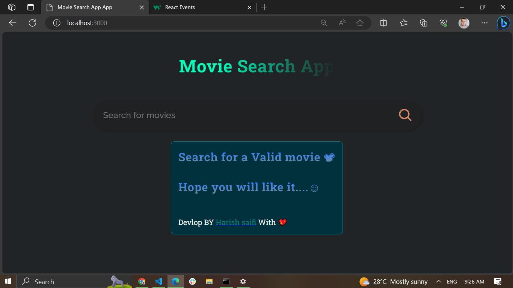
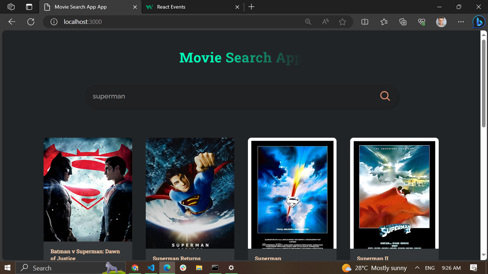

# Movie Search App



## Introduction

The Movie Search App is a web application developed using React, CSS, and hooks. This application allows users to search for movie information by entering a movie title. It fetches movie data from the OMDB API and displays relevant details about the movies.

You can access the live version of the app [here](https://mymoviesearch.netlify.app).


## Features

- Search for movies by entering a title.
- View detailed information about each movie, including its title, year of release, plot, and more.
- User-friendly and responsive design.
- Quick and easy access to movie data from the OMDB API.

## Technologies Used

- **React:** The project is built using React, a popular JavaScript library for building user interfaces.
- **CSS:** Custom CSS styles have been applied to create an appealing and user-friendly interface.
- **React Hooks:** Hooks like `useState` and `useEffect` are used to manage state and side effects.
- **OMDB API:** Movie data is fetched from the OMDB API, which provides comprehensive information about movies.

## Getting Started

To run this project locally, follow these steps:

Clone the repository to your local machine:

```bash
git clone https://github.com/arishsaifi/movie-search-app.git

cd movie-search-app

npm install

npm start
```
Open your web browser and visit http://localhost:3000 to access the Movie Search App locally.

## Usage
1. Open the Movie Search App by visiting 

2. In the search bar, enter the title of the movie you want to search for and press Enter or click the Search button.

3. The app will fetch movie data from the OMDB API and display the results on the page.

4. Hover on a movie card to view more details about the selected movie.

## ScreeenShots




## Acknowledgments
The Movie Search App uses data from the OMDB API. Thanks to OMDB for providing movie information.

Feel free to contribute to the project by submitting issues or pull requests. If you have any questions or suggestions, please contact us at harishsaifi2003@outlook.com.

Happy movie searching!